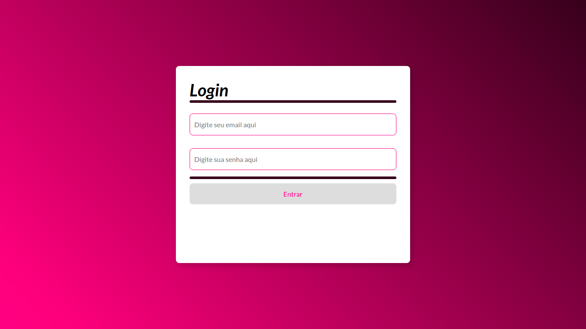
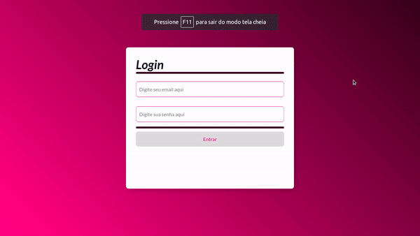

<h1 align="center">Trybewallet</h1>

<p align="center">Olá, seja bem vindo(a) ao projeto Trybewallet. <br>
Esse projeto foi desenvolvido durante o curso da Trybe no módulo de Front-end, utilizando
 <a href="https://pt-br.reactjs.org/"> React</a> e <a href="https://redux.js.org/"> Redux</a>. </p>

 <p align="center">
  <a href="#bookmark-sobre">Sobre</a>&nbsp;&nbsp;&nbsp;|&nbsp;&nbsp;&nbsp;
  <a href="#rocket-tecnologias">Tecnologias</a>&nbsp;&nbsp;&nbsp;|&nbsp;&nbsp;&nbsp;
  <a href="#hammer_and_wrench-features">Features</a>&nbsp;&nbsp;&nbsp;|&nbsp;&nbsp;&nbsp;
  <a href="#cloud-apis">APIs</a>&nbsp;&nbsp;&nbsp;|&nbsp;&nbsp;&nbsp;
  <a href="#notebook-instalação">Instalação</a>&nbsp;&nbsp;&nbsp;|&nbsp;&nbsp;&nbsp;
  <a href="#eyes-demonstração">Demonstração</a>&nbsp;&nbsp;&nbsp;|&nbsp;&nbsp;&nbsp;
</p>

<h2>:bookmark: Sobre</h2>
<p>
Este projeto é a representação de uma carteira de controle de gastos com conversor de moedas, criado utilizando React e Redux.
</p>


<h2>:rocket: Tecnologias</h2>

 As seguintes ferramentas foram usadas na construção do projeto:

-  [React](https://pt-br.reactjs.org/)
-  [Redux](https://redux.js.org/)

<h2>:hammer_and_wrench: Features</h2>

- [x] Adicionar, remover e editar um gasto;
- [x] Visualizar uma tabelas com seus gastos;
- [x] Visualizar o total de gastos convertidos para uma moeda de escolha;

<h2>:cloud: APIs</h2>

- [Economia](https://economia.awesomeapi.com.br/json/all)

<h2>:notebook: Instalação</h2>
<h3>Pré-requisitos</h3>

Antes de começar, você vai precisar ter instalado em sua máquina as seguintes ferramentas:

 **Node**: [Download Node.js](https://nodejs.org/en/download/)

 **Git**: [Download Git](https://git-scm.com/downloads)

 <h3>Rodando a aplicação</h3>

 ```bash
 # Clone este repositório
$ git clone  <https://github.com/Zeonnatios/trybewallet>

# Acesse a pasta do projeto no terminal/cmd
$ cd trybewallet/

# Instale as dependências
$ npm install

# Execute a aplicação
$ npm start

# O servidor inciará na porta:3000 - acesse <http://localhost:3000>
```
 <h2>:eyes: Demonstração</h2>


